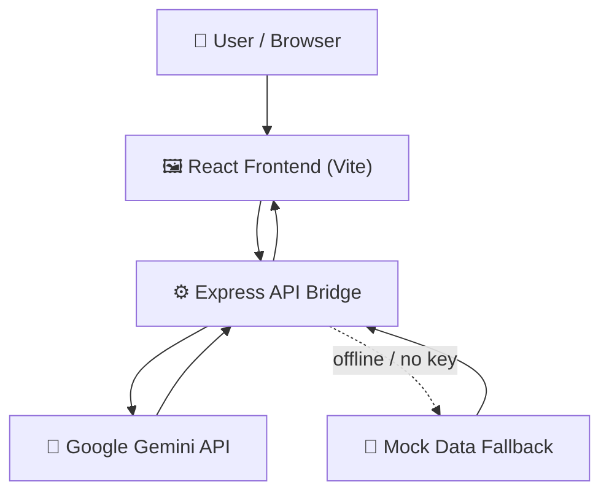

<div align="center">
  <!-- Ensure the filename matches EXACTLY what you see in the folder -->
  
  
  <h1>AURA-OS</h1>
  <p><b>Automated Unified Resources & Allocation OS</b></p>
  <p><i>A PromptWars Submission — Architected and built in Google AI Studio.</i></p>
</div>

  # AURA-OS
  ### Adaptive Unified Reasoning Agents

  <i>Architected & built in Google AI Studio — submitted for <b>PromptWars</b></i>
  <!-- Add this line to your existing Tech Stack list -->
<a href="(https://ai.studio/apps/37cf82d0-5989-48d7-8199-d7cf42f79cd3)" target="_blank">
  
</a>
  <br/>

  
  
  
  
  
  

  
  

</div>

---

## 🧠 About AURA-OS

**AURA (Adaptive Unified Reasoning Agents)** is an AI-first operating layer that takes a raw **Google AI Studio / Gemini** prototype and turns it into a real, production-shaped full-stack application — in one clean, deployable structure.

Instead of hand-wiring Express, Vite, TypeScript, and an AI SDK together from scratch, AURA-OS gives you a **secure, modular, ready-to-run boilerplate** where reasoning agents (powered by Gemini) sit behind a proper backend bridge and talk to a polished React frontend.

Built for **PromptWars**, AURA-OS is a proof-of-concept for **AI-First Development** — where the architecture itself is designed through iterative prompt engineering in AI Studio, rather than assembled component-by-component by hand.

---

## ⚡ Why AURA-OS?

| | |
|---|---|
| 🚀 **Instant Boilerplate** | Skip the Express + Vite + TypeScript setup dance. AURA-OS ships it pre-wired. |
| 🤖 **Gemini-First** | Pre-configured with the official `@google/genai` SDK, ready for reasoning agents out of the box. |
| 🔒 **Secure by Design** | API keys never touch the client — every call is routed through a backend bridge. |
| 🧩 **Mock-Ready** | A graceful mock-data fallback keeps you building UI even when you're offline or out of API credits. |
| 🏗️ **AI-Native Architecture** | Code structure optimized for AI-assisted development and maintainability. |

---

## 🧭 The PromptWars Approach

This project was **not** built component-by-component in the traditional sense. It was conceptualized and refined through an iterative prompt-engineering workflow inside Google AI Studio, using Gemini's reasoning to converge on a clean, modular full-stack architecture centered on three principles:

1. **Intent-Driven Architecture** — structure and naming optimized so an AI agent (or a human) can reason about and extend the codebase quickly.
2. **Graceful Fail-States** — a built-in mock-data system means development never stalls, even if the API is rate-limited or offline.
3. **Secure Bridge Pattern** — a clean separation of concerns keeps sensitive Gemini API keys server-side, never exposed to the browser.

---

## 🏗️ Architecture



The frontend never talks to Gemini directly — every request flows through the Express bridge, which handles authentication, key security, and gracefully falls back to mock data when needed.

---

## 📦 Key Features

- **Hybrid Server** — an Express backend powering a Vite-served React frontend in one unified dev experience.
- **Smart Components** — modular, AI-engineered UI components built for rapid iteration.
- **Secure API Bridge** — a standardized, key-safe interface for generating content via Gemini models.
- **Offline-Safe Development** — mock fallbacks mean the UI layer can be built and demoed without live API calls.

---

## 🎯 Use Cases

- Turning a Google AI Studio prompt prototype into a real, locally-runnable web app.
- Building a custom React UI that talks to Gemini models through a secure Express backend.
- Developing and demoing AI-powered conversational or generative features — even without a live connection.

---

## 🛠️ Tech Stack

- **Frontend:** React + TypeScript + Vite + Tailwind CSS
- **Backend:** Express.js (secure API bridge)
- **AI Layer:** Google Gemini (`@google/genai`)
- **Tooling:** Built and iterated on entirely within Google AI Studio

---

## 🚀 Quick Start

```bash
# 1. Clone the repository
git clone https://github.com/ryzenNS/AURA-OS.git
cd AURA-OS

# 2. Install dependencies
npm install

# 3. Add your Gemini API key
echo "GEMINI_API_KEY=your_key_here" > .env

# 4. Start the engine
npm run dev
```

The app will spin up the Express API bridge and the Vite-served React frontend together — no separate terminals required.

---

## 📁 Project Structure

```
/src
├── components/       # AI-engineered modular UI components
├── assets/           # Application assets (images, icons, etc.)
├── App.tsx           # Main application entry
└── main.tsx          # Client-side bootstrap
server.ts             # Secure backend API bridge (Gemini bridge)
```

---

## 🗺️ Roadmap

- [ ] Multi-agent orchestration support
- [ ] Persistent conversation/session storage
- [ ] Plug-and-play model switching (beyond Gemini)
- [ ] One-click deploy template

---

## 👥 Contributors

Built with the help of the community and optimized by the power of Google Gemini.

<p align="left">
  <a href="https://github.com/ryzenNS" title="ryzenNS">
    
  </a>
</p>

---

<div align="center">
  <sub>Built with ⚡ by an AI-Augmented Developer — for PromptWars</sub>
</div>
