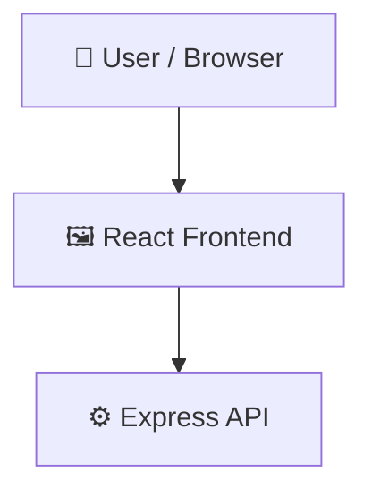

# AURA-OS

> Run Gemini-powered AI Studio applications locally using Express and React.

## 📑 Table of Contents

- [Description](#description)
- [Key Features](#key-features)
- [Use Cases](#use-cases)
- [Screenshots](#screenshots)
- [Tech Stack](#tech-stack)
- [Architecture](#architecture)
- [Quick Start](#quick-start)
- [Key Dependencies](#key-dependencies)
- [Available Scripts](#available-scripts)
- [API Endpoints](#api-endpoints)
- [Project Structure](#project-structure)
- [Development Setup](#development-setup)
- [Contributors](#contributors)
- [Contributing](#contributing)

## 📝 Description

AURA-OS is a web application template designed to run and deploy AI Studio apps locally. The application integrates a React frontend with an Express backend, providing a developer-friendly environment to construct and test interfaces powered by Google's Gemini models. The architecture leverages Vite as a development server integrated with Express to serve both client-side React assets and backend API endpoints. On the backend, the application connects to the Google Gemini API using the official @google/genai SDK, configuring secure credential handling and API requests. This setup is ideal for developers who want to transition their AI Studio prototypes into local environments. It provides a baseline with TypeScript, Tailwind CSS, and a functioning API bridge to ensure smooth development before deployment.

## ✨ Key Features

- **🤖 Google Gemini SDK Integration** — Connects to Google's GenAI services via the official @google/genai library using a configured Gemini API key.
- **⚡ Hybrid Express and Vite Server** — Runs an Express backend alongside a Vite development server to deliver React frontend assets and API endpoints.
- **⚛️ TypeScript and React Architecture** — Provides a structured UI workspace built with React, Tailwind CSS, and TypeScript for robust client-side development.
- **🛠️ Graceful Mock Data Fallbacks** — Automatically warns developers and defaults to mock responses when the GEMINI_API_KEY environment variable is missing.

## 🎯 Use Cases

- Transitioning a prompt prototype designed in Google AI Studio into a local web application.
- Building a custom React-based user interface that communicates with Gemini AI models via a secure Express backend.
- Developing and testing AI-powered conversational or generation features locally using mock fallbacks.

## 📸 Screenshots


## 🛠️ Tech Stack

    

## 🏗️ Architecture

A high-level view of how the main pieces fit together:



## ⚡ Quick Start

```bash

# 1. Clone the repository
git clone https://github.com/ryzenNS/AURA-OS.git

# 2. Install dependencies
npm install

# 3. Start the dev server
npm run dev
```

## 📦 Key Dependencies

```
@google/genai: ^2.4.0
@tailwindcss/vite: ^4.1.14
@vitejs/plugin-react: ^5.0.4
dotenv: ^17.2.3
express: ^4.21.2
lucide-react: ^0.546.0
motion: ^12.23.24
react: ^19.0.1
react-dom: ^19.0.1
react-markdown: ^10.1.0
vite: ^6.2.3
```

## 🚀 Available Scripts

- **dev** — `npm run dev`
- **build** — `npm run build`
- **start** — `npm run start`
- **clean** — `npm run clean`
- **lint** — `npm run lint`

## 🌐 API Endpoints

Detected endpoints (best-effort scan):

```
GET /api/stadium-state
POST /api/stadium-state
GET /api/orders
POST /api/orders
POST /api/orders/:id/status
POST /api/gemini/generate
GET *
```

## 📁 Project Structure

```
Prompt war_C4
├── index.html
├── metadata.json
├── package.json
├── server.ts
├── src
│   ├── App.tsx
│   ├── assets
│   │   └── images
│   │       └── fifa_championship_banner_1784128123048.jpg
│   ├── components
│   │   ├── AccessibilityAI.tsx
│   │   ├── AiConcierge.tsx
│   │   ├── AuraChat.tsx
│   │   ├── AuraLogo.tsx
│   │   ├── EmergencyAI.tsx
│   │   ├── ExplorerTwin.tsx
│   │   ├── FoodAI.tsx
│   │   ├── HomeDashboard.tsx
│   │   ├── KickOffTransition.tsx
│   │   ├── LiveScoresBar.tsx
│   │   ├── LoginPortal.tsx
│   │   ├── LostAndFoundAI.tsx
│   │   ├── MatchCompanion.tsx
│   │   ├── OperationsSidebar.tsx
│   │   ├── RestaurantsMenu.tsx
│   │   ├── ScenarioSelector.tsx
│   │   ├── SettingsAI.tsx
│   │   ├── ShoppingAI.tsx
│   │   ├── SmartNavigation.tsx
│   │   ├── StadiumVisualizer.tsx
│   │   └── SustainabilityTracker.tsx
│   ├── index.css
│   ├── main.tsx
│   └── types.ts
├── tsconfig.json
└── vite.config.ts
```

## 🛠️ Development Setup

### Node.js / JavaScript
1. Install Node.js (v18+ recommended)
2. Install dependencies: `npm install` (or `yarn` / `pnpm install` / `bun install`)
3. Start the dev server: see the **Quick Start** above

## 👥 Contributors

Thanks to everyone who has contributed to this project:

<p align="left">
<a href="https://github.com/ryzenNS" title="ryzenNS"></a>
</p>

[See the full list of contributors →](https://github.com/ryzenNS/AURA-OS/graphs/contributors)

## 👥 Contributing

Contributions are welcome! Here's the standard flow:

1. **Fork** the repository
2. **Clone** your fork: `git clone https://github.com/ryzenNS/AURA-OS.git`
3. **Branch**: `git checkout -b feature/your-feature`
4. **Commit**: `git commit -m 'feat: add some feature'`
5. **Push**: `git push origin feature/your-feature`
6. **Open** a pull request

Please follow the existing code style and include tests for new behavior where applicable.

---

<div align="center">

[](https://readmebuddy.com)

<sub>Generate beautiful READMEs in seconds → <a href="https://readmebuddy.com">readmebuddy.com</a></sub>

</div>
